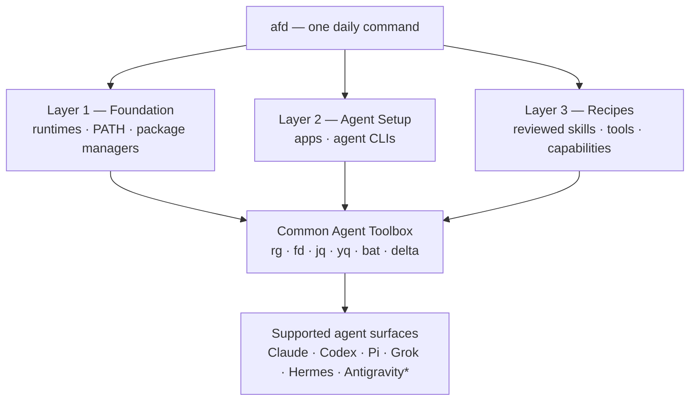

# AI Foundry Desk

**Multi-Agent Workbench**

[](https://github.com/smota/ai-foundry-desk)
[](https://github.com/smota/ai-foundry-desk/subscription)
[](LICENSE)
[](https://github.com/smota/ai-foundry-desk/releases/latest)
[](docs/README-LAYER-1.md)
[](docs/PLATFORM-SUPPORT.md)


<p align="center">
  
</p>

## Your AI tools, one clean workbench

AI Foundry Desk turns a personal computer into a manageable multi-agent development environment.
It gives your agents a consistent foundation, a shared set of practical tools, and controlled ways
to install, inspect, repair, and synchronize the environment—so you can focus on the work that
matters instead of maintaining six different setups.

Use AFD to:

- prepare a predictable workstation for multiple AI coding agents;
- keep runtimes, command-line tools, skills, and small profiles organized;
- preview every important change before applying it;
- detect drift and repair only the configuration AFD owns;
- add more agents over time without turning your machine into an unmanageable stack.

AFD is a local personal workbench. It is not a SaaS platform, a team orchestrator, or a credential
manager. Your logins, tokens, projects, conversations, and agent-native data remain outside it.

## Choose your path

| I want to… | Start here | Time |
| --- | --- | --- |
| Set up my workstation | [Windows quick start](#quick-start-on-windows) or [Linux/WSL bootstrap](#linuxwsl-bootstrap) | About 10 minutes plus downloads |
| Check or repair an existing setup | [`afd doctor`](#your-everyday-workflow), then preview the suggested fix | 2–5 minutes |
| Keep skills and profiles consistent across agents | [Skills and profiles](docs/LAYER-2-SYNC.md) | 10 minutes |
| Keep MCP servers consistent across agents and scopes | [MCP configuration](docs/MCP-CONFIGURATION.md) | 10 minutes |
| Apply a reviewed bundle of tools and skills | [Layer 3 recipes](docs/LAYER-3-RECIPES.md) | 10–20 minutes |
| Understand an agent run | [Observability](docs/OBSERVABILITY.md) | 10 minutes |
| Standardize instructions in a repository | [Project harnesses](docs/PROJECT-HARNESSES.md) | 15 minutes |
| Look up an `afd` command | [CLI reference](docs/CLI.md) | 1 minute |
| Explore every capability interactively | [`afd tui`](docs/TUI.md) | 1 minute |
| Understand or change the project | [Contributor guide](CONTRIBUTING.md) | 10 minutes |

## Common use cases

- **A clean first setup:** preview and install the runtime foundation, agent CLIs, and shared toolbox.
- **A workstation health check:** find PATH, runtime, backup, or sandbox-access problems without
  changing the machine.
- **Safe repair after an update:** reconcile only AFD-owned state after package-manager or agent
  upgrades.
- **Cross-agent consistency:** review shared skills and small profile blocks, preserve drift, then
  synchronize intentionally.
- **Scoped MCP configuration:** discover and synchronize selected tool-server definitions without
  copying credentials or overwriting unmanaged entries.
- **Repeatable workstation recipes:** plan, approve, apply, verify, and roll back declarative bundles.
- **Local execution evidence:** inspect bounded, content-free telemetry and correlate supported agent
  activity without copying conversations.
- **Repository instruction governance:** audit and test one canonical project policy across supported
  agents before applying it.

## How the workbench fits together



`*` Capabilities vary by agent. AFD reports unsupported integrations instead of pretending they
work.

| Module | Objective | What it gives you |
| --- | --- | --- |
| **Layer 1 — Foundation** | Build a stable base | mise-managed Python, Node.js, Go and Rust; uv, pnpm, PATH, guardrails, doctor and controlled repair |
| **Layer 2 — Agent Setup** | Make agents available consistently | Idempotent detection and installation of supported desktop apps and CLIs without handling login credentials |
| **Common Agent Toolbox** | Give every agent dependable utilities | Fast search, file discovery, structured-data processing, readable source output and clear diffs |
| **Agent Manager** | Keep shared guidance manageable | A canonical skill catalog, small profiles, one-way sync, drift detection, review and safe import/adopt |
| **Project Harnesses** | Keep repository agents consistent | One canonical policy, minimal adapters, external staging, disposable cross-agent smoke tests, confirmed apply and exact rollback |
| **MCP configuration** | Keep tool-server setup consistent | Scoped registries, redacted discovery, hash-bound preview/apply, native enable/disable and atomic moves |
| **Layer 3 — Recipes** | Provision reviewed bundles | Uniform internal/local/HTTPS loading, mandatory plan, confirmed apply, verification and managed-only rollback |
| **Observability** | Explain agent execution locally | Recipe-managed OTLP Collector, Phoenix traces, agentacct session intelligence, bounded correlation and explicit per-agent coverage |
| **Recovery** | Keep managed changes reversible | Local backups with bounded retention before AFD changes an existing managed file |

For a fast, linked catalog of every tool and product, see the
[Layer inventory](docs/LAYER-INVENTORY.md). It includes logos where available, a short description,
the component's objective, installation ownership, and platform boundaries.

For repository instruction consolidation, see [Project harnesses](docs/PROJECT-HARNESSES.md).

## Quick start on Windows

You do not need to clone the repository or understand the internal scripts.

### 1. Open PowerShell

Open a regular PowerShell window as your normal user. Administrator access is not required.

### 2. Install the `afd` command

Copy the command below, paste it into PowerShell, and press Enter. It downloads the versioned
Windows bootstrap and checksum separately, verifies SHA-256, and installs only the AFD command.
It does **not** configure either Layer automatically.

```powershell
$v='0.6.4'; $u="https://github.com/smota/ai-foundry-desk/releases/download/v$v"; $d=Join-Path $env:TEMP "afd-$v"; New-Item -ItemType Directory -Force $d | Out-Null; Invoke-WebRequest "$u/afd-bootstrap-windows.ps1" -OutFile "$d/afd-bootstrap-windows.ps1"; Invoke-WebRequest "$u/afd-bootstrap-windows.ps1.sha256" -OutFile "$d/afd-bootstrap-windows.ps1.sha256"; $e=((Get-Content "$d/afd-bootstrap-windows.ps1.sha256") -split '\s+')[0]; if((Get-FileHash "$d/afd-bootstrap-windows.ps1" -Algorithm SHA256).Hash -ne $e){throw 'AFD bootstrap checksum mismatch'}; & "$d/afd-bootstrap-windows.ps1" -Version $v
```

The bootstrap requires Node.js 24 or newer and pnpm. If a prerequisite is missing, it stops and
explains what is needed; it does not silently apply a Layer.

### 3. Preview, then apply

Open a new PowerShell window and run:

```powershell
afd init --dry-run
afd doctor
afd layer1 --dry-run
```

Review the output. When you are comfortable with the plan:

```powershell
afd layer1 --apply
afd layer2 --dry-run
afd layer2 --apply
```

Login or OAuth remains a manual step inside each agent. AFD never asks for or stores those
credentials.

## Your everyday workflow

Once the workstation is ready, these are the commands most people need:

```powershell
afd status              # See the shared environment and pending changes
afd doctor              # Explain Foundation problems without changing anything
afd verify              # Run the compact product verification suite
afd sync --dry-run      # Preview shared skill/profile changes
afd sync                # Apply reviewed, one-way synchronization
afd layer3 plan builtin:smota-foundations # Preview a recipe; shorthand also only plans
afd telemetry status --json    # See live and session evidence per agent
afd telemetry explain <run-id> # Explain one correlated run without exposing content
afd mcp status --scope effective --project . # Preview MCP configuration drift
```

Observability is activated by applying a recipe that includes it. That reviewed recipe is the
single consent decision for Collector, Phoenix, agentacct, native integrations and autostart; there
is no second agentacct prompt. See [Observability](docs/OBSERVABILITY.md) for current agent coverage
and privacy boundaries.

If Layer 1 needs repair, preview the exact reconciliation first:

```powershell
afd fix layer1 --dry-run
afd fix layer1 --apply
```

`fix` does not reset the computer. It only reconciles declared AFD packages and runtimes, managed
PATH/environment entries, shims, PNPM_HOME, and marked profile blocks. Windows aliases,
third-party runtimes, projects, credentials, services, agents, and Layer 2 remain untouched.

AFD does not replace WinGet or take ownership of third-party updates. Portable-package upgrades can
replace an executable file and therefore invalidate sandbox-access metadata attached to the old file.
After normal updates—including `winget upgrade --all`—run the read-only doctor:

```powershell
winget upgrade --all
afd doctor
```

If `sandbox.toolchain-access` reports drift, review and apply only the declared RX-only repair:

```powershell
afd fix sandbox --dry-run
afd fix sandbox --apply
```

The repair never installs, downgrades, pins, or updates the tools themselves. It refuses sandbox or
hybrid identities, snapshots the prior ACL state, and verifies the postcondition after apply. Start a
fresh Codex task after a tool or Codex upgrade. See [Environment ownership](docs/ENVIRONMENT-OWNERSHIP.md)
and [Agent sandbox toolchain repair](docs/AGENT-SANDBOX-REPAIR.md).

For automation, `afd doctor --json` provides a stable schema with category, severity, code,
sanitized evidence, and a suggested action.

## Common Agent Toolbox

Agents are much more effective when they can rely on the same small set of fast, composable tools.
AFD provides a practical baseline for every supported agent without changing global Git behavior or
adding project-specific aliases.

| Command | Purpose | Typical use |
| --- | --- | --- |
| `rg` | Fast text search that respects ignore files | Find symbols, messages, configuration, and references across a repository |
| `fd` | Friendly, fast file discovery | Locate source files and directories without complex search syntax |
| `jq` | JSON inspection and transformation | Read API responses, package metadata, and machine-readable output |
| `yq` | YAML and TOML inspection | Work with workflows, manifests, and configuration files |
| `bat` | Read source with syntax highlighting and context | Inspect files clearly without modifying them |
| `delta` | Readable diffs | Review code changes and understand what an agent proposes |

These tools are preferences, not mandates. AFD and its agents still use native alternatives when a
project or operating system requires them, and tool availability never authorizes a mutating action.

## Platform support

- **Windows x64:** complete validated workstation experience, including both Layers, doctor/fix,
  Agent Manager, toolbox, backups, and verification.
- **Ubuntu 26.04.1 LTS on WSL2 x86_64:** native Layer 1 runtime and Docker adapters, native Layer 2
  CLI/toolbox adapters, portable Layer 3 recipes, doctor/fix, and verification are implemented.
- **macOS:** experimental detection only; no validated support claim.

See [Platform support](docs/PLATFORM-SUPPORT.md) for the exact test boundary. Contributions for
native Linux and macOS adapters are welcome when they preserve one portable core and document real
validation evidence.

### Linux/WSL bootstrap

`scripts/afd-bootstrap-posix.sh` is a separate POSIX adapter with `--dry-run`, SHA-256 verification,
and an isolated `--prefix`. The bootstrap installs only `afd` and never applies Layers. On Linux,
run `afd layer1 --dry-run`, review the native runtime and Docker plan, then use `--apply`. Layer 2
follows the same preview/apply contract. macOS detection remains experimental and fail-closed.

```sh
afd layer1 --dry-run
afd layer1 --apply
afd doctor
afd layer2 --dry-run
afd layer2 --apply
afd verify
```
Never use a blind remote pipe; download the script and checksum separately before execution.

Validated Linux/WSL bootstrap (downloads, verifies, then executes as separate steps):

```sh
v=0.6.4; base="https://github.com/smota/ai-foundry-desk/releases/download/v$v"; dir="$(mktemp -d)"; curl -fL "$base/afd-bootstrap-posix.sh" -o "$dir/afd-bootstrap-posix.sh"; curl -fL "$base/afd-bootstrap-posix.sh.sha256" -o "$dir/afd-bootstrap-posix.sh.sha256"; (cd "$dir" && sha256sum -c afd-bootstrap-posix.sh.sha256); sh "$dir/afd-bootstrap-posix.sh" --version "$v"
```

Docker is a Layer 1 host capability, not an AFD runtime. Layers 1–3 run directly on the host. Higher
layers may use Docker only when explicitly requested or required by a documented dependency. AFD
does not automatically add users to the root-equivalent `docker` group.

## Safety by design

- Important changes have a `--dry-run` or `-WhatIf` preview.
- Doctor and all dry-runs are read-only: no logs, state, backups, PATH, profiles, or installations.
- Drift is reported and preserved instead of silently overwritten.
- Normal package-manager updates remain supported; AFD validates their declared interoperability
  postconditions instead of intercepting or replacing the update operation.
- Existing managed files are backed up before a real change.
- Skills created by an agent are never promoted automatically.
- Tokens, logins, history, memory, sessions, projects, and proprietary plugins are not shared.
- Layers never run during CLI installation or `afd init`.

Canonical configuration lives under `%USERPROFILE%\.afd`. Operational state and bounded backups
live under `%LOCALAPPDATA%\AI Foundry Desk`; neither is included in releases.

## For contributors

Clone the repository only for development or auditing:

```powershell
pnpm install --frozen-lockfile
pnpm check
.\install-local.ps1
```

Start with [Contributing](CONTRIBUTING.md), [Architecture](docs/ARCHITECTURE.md), and the
[development guide](docs/DEVELOPMENT.md). The repository includes issue forms, a pull-request
template, ownership routing, and cross-platform CI checks.

## Documentation

Use the [documentation map](docs/README.md) to find task guides, concepts, operations, architecture,
security, and project references. The complete command syntax is in the [CLI reference](docs/CLI.md).

AI Foundry Desk is available under the [MIT License](LICENSE). See [SECURITY.md](SECURITY.md) for
responsible reporting. Brand artwork is documented in [assets/brand/README.md](assets/brand/README.md).
