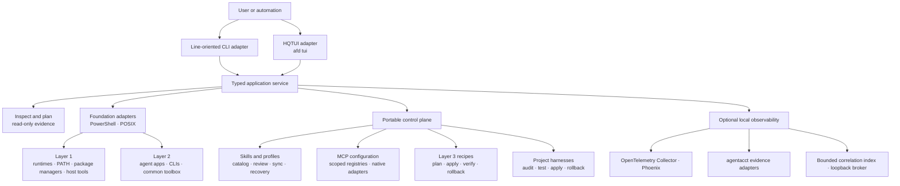
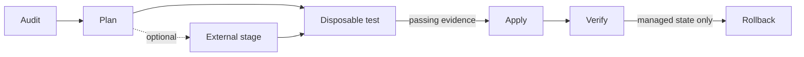

# Architecture

AI Foundry Desk is a local control plane for a personal multi-agent workstation. Its line-oriented
CLI and interactive terminal UI coordinate the same typed application service, platform adapters,
portable TypeScript core, declarative recipes, and bounded local state. It does not proxy agent
conversations, store credentials, or orchestrate a remote team.

## System at a glance

Layers 1–3 are sequential workstation foundations. Observability and project harnesses are
independent capabilities built on the same safety and platform contracts; they are not additional
layers.

## Major components

### Interfaces, application service, and portable core

`agent-manager/src/cli.ts` is the public executable entry point. It selects either the normal CLI
adapter or `afd tui`. `command-service.ts` owns command orchestration and is shared by both
interfaces. `application-service.ts` converts in-process command execution into typed stdout/stderr
events, exit codes, and outcomes without invoking a shell or parsing rendered CLI output.

The HQTUI adapter under `src/tui` owns navigation, transient form state, selection/focus,
confirmation presentation, and rendering only. `capability-registry.ts` provides the complete
machine-checkable taxonomy and safety class. Validation, confirmation tokens, drift detection,
redaction, transactions, platform effects, receipts, and rollback stay below both interfaces.
See [Terminal user interface](TUI.md) for workflows and real screens.

The main source areas are:

| Area | Responsibility |
| --- | --- |
| `cli.ts`, `command-service.ts`, `application-service.ts` | CLI/TUI selection, shared command orchestration, typed output events, and exit-code outcomes |
| `capability-registry.ts`, `tui/*` | Complete UI taxonomy, responsive rendering, input state, explicit confirmation, and command palette |
| `catalog.ts`, `manager.ts`, `review.ts` | Agent capability catalog, inspection, synchronization, pending review, promotion, rejection, and recovery |
| `mcp-*.ts` | Scoped MCP registries, format-preserving native adapters, redacted discovery, hash-bound planning, transactional apply, and verification |
| `foundation.ts`, `doctor.ts`, `sandbox-access.ts` | Declarative foundation plans, diagnostics, execution identity, and sandbox-access postconditions |
| `recipes.ts`, `extract.ts` | Recipe loading, schema validation, planning, approval tokens, managed apply/verify/rollback, and sanitized extraction |
| `harness-*.ts` | Project-policy audit, planning, external staging, disposable smoke tests, transactional apply, receipts, verification, and rollback |
| `telemetry*.ts`, `agentacct-adapter.ts`, `autostart.ts` | Bounded telemetry contracts, runtime lifecycle, evidence correlation, native integrations, broker, and autostart |
| `platform.ts`, `contracts.ts` | Filesystem/process boundary, common data types, atomic writes, private permissions, downloads, and managed process identity |

`agent-manager/schema` contains the public JSON schemas. Tests mirror these source areas under
`agent-manager/test`.

### Platform adapters and scripts

Windows-specific installation, PATH, ACL, and workstation behavior lives in allowlisted PowerShell
scripts under `scripts/`. Linux and macOS use explicit POSIX adapters. The CLI invokes only known
scripts and passes structured, bounded arguments; it is not a general remote-script runner.

- Layer 1 owns the mise-managed language runtimes, uv, pnpm, the integrity-pinned LavaMoat
  allow-scripts CLI, declared PATH entries, shims, and native Docker host capability. Project policy
  remains project-owned and Docker never becomes the execution wrapper for Layers 1–3.
- Layer 2 owns supported agent installers and the common toolbox (`rg`, `fd`, `jq`, `yq`, `bat`, and
  `delta`). It does not own agent authentication or general third-party updates.
- macOS Layer 1 uses architecture-specific checksummed runtime and Docker artifacts; Layer 2 remains
  unimplemented and fails closed. Real-hardware validation is required before a validated claim.

See [Platform support](PLATFORM-SUPPORT.md) for the validated environment boundary and
[Environment ownership](ENVIRONMENT-OWNERSHIP.md) for the exact ownership model.

### Shared catalog and Layer 3 recipes

The user catalog is canonical under `~/.afd`. Codex, Pi, and Grok consume the shared skill root;
Claude, Antigravity, and managed Hermes receive one-way mirrors where supported. Small managed
profile blocks are supported only for agents with a stable contract. Divergent content is reported
and preserved rather than overwritten.

Layer 3 recipes describe desired state as data. A source may be built in, local, or direct HTTPS.
Planning normalizes the source and expands every managed effect into a content-derived approval
token. Apply revalidates the token, records only the state it manages, and verifies the result.
Rollback restores or removes only recorded managed state. HTTPS loading rejects redirects and
arbitrary executable adapters.

### MCP configuration

MCP configuration is separate from skill/profile synchronization. AFD maintains canonical user and
project registries, computes effective configuration, and adapts explicitly selected definitions to
verified agent-native formats. Discovery and status are read-only. Sync, adoption, enable/disable,
and scope moves produce redacted content-derived plans before any write.

The MCP manager preserves unrelated native settings and unmanaged servers, rejects inline secret-like
values, never reads OAuth/login stores, and uses fingerprints to reject concurrent edits. Apply is
transactional across selected targets. Unsupported scope/agent combinations block instead of being
silently omitted. See the [MCP configuration guide](MCP-CONFIGURATION.md) for the user workflow and
the [configuration design](MCP-CONFIGURATION-DESIGN.md) for registry and adapter rationale.

### Project harnesses

Harnesses govern agent instructions inside a repository without mixing them into the user-level
catalog. The workflow is deliberately evidence-gated:

Audit and plan are read-only. Live tests render proposed policy into a disposable workspace and
require every selected agent to return consistent canonical-policy evidence. Apply requires both a
matching plan token and passing evidence. Receipts are private and stored outside the target
project; verification covers the complete Git-visible workspace fingerprint.

### Observability

Observability is a recipe-managed optional capability. One reviewed recipe plan is the consent
boundary for its declared installation, configuration, integrations, startup, and autostart effects.
The OpenTelemetry Collector filters and routes bounded spans, Phoenix presents local traces,
agentacct derives supported local session evidence, and AFD keeps a bounded correlation index.

AFD does not wrap every agent invocation or copy complete third-party evidence stores. On Windows,
a bearer-authenticated loopback broker lets sandboxed clients request only the fixed operations
`status`, `resume`, `verify`, `stop`, `refresh`, and `explain` under the interactive user's identity.
See [Observability](OBSERVABILITY.md) for current agent coverage and [Security boundaries](SECURITY-BOUNDARIES.md)
for the content allowlist.

## State and ownership

| Location | Owner and contents |
| --- | --- |
| Product installation | Versioned CLI, schemas, recipes, scripts, and documentation; no user secrets or runtime state |
| `~/.afd` | Canonical user catalog, manifests, managed skills/profiles, and pending review state |
| `~/.afd/mcp/user.json` | Canonical workstation-wide MCP definitions |
| `<project>/.afd/mcp.json` | Canonical project-scoped MCP definitions |
| `%LOCALAPPDATA%\AI Foundry Desk` on Windows | Operational state, bounded backups, telemetry state, and private receipts |
| Agent-native directories | Agent-owned authentication, history, memory, sessions, plugins, and unmanaged configuration |
| User projects | Project-owned source and policy; harness changes require evidence and explicit confirmation |

Existing managed files are snapshotted before replacement. Backups are bounded by retention policy.
Operational state and backups are excluded from release artifacts.

## Safety invariants

Every component follows the same rules:

1. Inspection and dry-run paths do not write logs, state, backups, profiles, or installations.
2. Mutations require an explicit apply/confirm action; recipe and harness mutations bind approval to
   exact content.
3. Drift and user-owned content are preserved or fail closed, never silently normalized.
4. Filesystem writes use validated paths, atomic replacement where applicable, and private
   permissions for sensitive operational state.
5. Downloads require HTTPS and pinned integrity evidence where the adapter contract calls for it.
6. Process lifecycle operations target recorded process identity, not a broad process name.
7. Credentials, conversation bodies, command output, file content, and raw private paths stay
   outside shared catalog and telemetry payloads.

These invariants are enforced in implementation tests, not only documented as intent.

## Adding or changing a capability

Keep portable policy in TypeScript and isolate operating-system effects behind a platform adapter or
an allowlisted script. A complete change updates implementation, contracts or schemas, tests, the
[CLI reference](CLI.md), task guides, and platform evidence together. New managed effects need a
read-only plan, explicit confirmation, verification, and a bounded rollback story.

Start with [Contributing](../CONTRIBUTING.md) and [Development](DEVELOPMENT.md). Broad changes to
architecture, security boundaries, command contracts, or machine ownership should begin as a
proposal before implementation.
