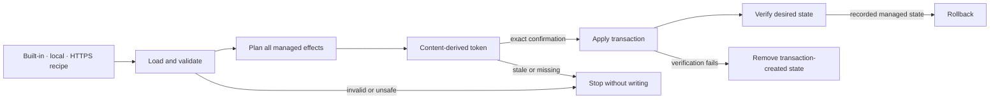

# Layer 3 recipes

Layer 3 provisions reviewed global skills and tools from a versioned declarative recipe. Internal
recipes (`builtin:<id>`), local files/directories, and HTTPS JSON use the same strict loader. A URL
redirect, unavailable response, invalid schema, unsafe relative path, duplicate ID, unverified tool
adapter, or unsupported agent blocks application without writing.

Recipe schema version 2 adds a typed capability section rather than disguising long-running
components as tools. Version 1 remains valid for skill/tool-only recipes.
Recipe schema version 3 adds exact mise-managed tools, immutable Herdr plugin sources,
and explicit Windows, Linux, and macOS applicability. It uses the Layer 1 mise installation; it
does not install, repair, or replace mise itself.
For a recipe containing Observability, its expanded plan and content-derived confirmation token are
the complete activation decision for Collector, Phoenix, agentacct, declared native integrations,
policies, and lifecycle. Apply must not request a second component-specific confirmation.



```text
afd layer3 recipes
afd layer3 show builtin:smota-foundations
afd layer3 plan builtin:smota-foundations
afd layer3 builtin:smota-foundations
afd layer3 apply builtin:smota-foundations --confirm <plan-token>
afd layer3 verify builtin:smota-foundations
afd layer3 rollback builtin:smota-foundations --confirm
afd layer3 show builtin:herdr-workbench
afd layer3 plan builtin:herdr-workbench
afd layer3 extract --output recipe.json
afd layer3 extract --output recipe.json --include skill-a,vibium
```

`builtin:observability` is the telemetry-v2 recipe. `afd telemetry plan` and `apply` use it by
default; the expanded plan token is the single activation decision for all declared effects.

The shorthand is plan-only. Plan emits a deterministic approval token; apply requires that exact
token, so a stale or skipped preview cannot install. Rollback requires confirmation. Apply records exact paths and
rollback removes only paths created by that application. Existing destinations are preserved.
External recipes never execute embedded scripts. Extraction first prints a sanitized inventory and
requires a second invocation naming what to include; it emits IDs and portable placeholders, never
tokens, sessions, credentials, environment files, or private absolute paths.

## smota-foundations

`builtin:smota-foundations` describes Holoself, Vibium, and Tokscale. Holoself uses `AFD_HOLOSELF_ROOT` for the
private local overlay; its machine-specific path never enters the public recipe. Windows reads the
persisted user variable; Linux may use the process environment or `~/.config/afd/overlays.json`.
Broken overlay links are warnings only, and rollback never touches overlay data.

smota-foundations pins Vibium 26.8.21 and Tokscale 4.14.0 with their registry SHA-512 integrity values. The
allowlisted pnpm adapter verifies metadata before installation, records any prior global version,
validates each command, and restores the prior version (or removes only a newly managed package) on
rollback. Antigravity CLI uses its documented global `~/.gemini/antigravity-cli/skills/` adapter.
Vibium's optional first browser download remains a later explicit runtime action; recipe application
does not launch a browser.

## herdr-workbench

`builtin:herdr-workbench` pins Herdr 0.8.2 as `github:herdrdev/herdr` through the AFD-owned global mise configuration.
It does not configure Hermes or MCP. The same recipe applies on Windows, Linux/WSL2, and macOS, but
each environment has its own mise installation, state, verification, and rollback record. Windows
x64 and Ubuntu WSL2 are live-validation targets; macOS remains implemented and fixture-tested with
real-hardware validation pending.

Recipe v3 Herdr plugins use `owner/repo[/subdir]`, an immutable 40-character commit, the reviewed
`herdr-plugin.toml` SHA-256, an explicit enabled state, and an optional platform allowlist. Planning
retrieves the manifest from that exact commit and blocks on a mismatch. Apply refuses to replace a
divergent installed plugin. The built-in recipe intentionally contains no plugins until their exact
sources and setup contracts are reviewed; no placeholder source is executable.
