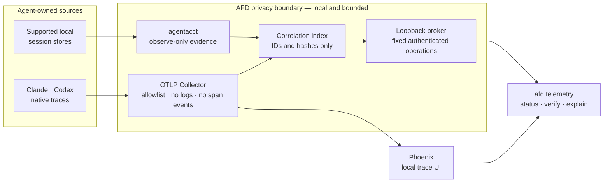

# Observability capability

Observability is a declarative AFD capability for normal Layer 2 use. It is enabled when the user
reviews and applies a recipe that includes it; agentacct does not ask for a second confirmation.
AFD does not wrap agent execution and does not maintain a proprietary Collector or session parser.



## Runtime

- OpenTelemetry Collector Contrib `0.159.0` receives OTLP/HTTP on `127.0.0.1:4318`, enforces the
  content-free allowlist, exports traces to Phoenix, and exposes host metrics on `127.0.0.1:9464`.
- Arize Phoenix `20.4.0` stores and displays local traces on `127.0.0.1:6006` with upstream
  telemetry and external resources disabled. It runs on an isolated, exact CPython `3.10.21`
  runtime because the supported Phoenix release is incompatible with Python 3.11.
- agentacct `0.10.1` runs observe-only in an isolated native environment, reads only its declared
  local agent stores, and keeps summarized evidence in an AFD-managed store. On Windows, AFD uses
  mise-managed Python, an uv-isolated tool environment, bounded file-lock and no-link path-traversal
  compatibility for the pinned upstream version, and
  AFD-owned process lifecycle. Neither the SQLite carrier nor the transcript tree is copied. Its watcher and local API use
  `127.0.0.1:8765` and are included in the recipe plan and health contract.
  This Windows contract covers imports, watcher, capabilities/health probes, and the loopback API;
  agentacct runner, wrapper, and activation process controls remain unsupported on Windows.
  Its managed root is `%USERPROFILE%\.afd\managed\telemetry-v2\agentacct`, avoiding packaged-app
  `%LOCALAPPDATA%` virtualization so interactive, broker, and sign-in identities share one store.
- A bounded AFD index correlates public run identifiers with trace identifiers. It stores no prompt,
  response, transcript, file content, command arguments, stdout, stderr, or credential material.

All listeners and exporters are loopback-only. The Collector is an existing upstream component,
downloaded as an exact artifact and verified by SHA-256; it is not developed by AFD.
Phoenix and agentacct resolve through recipe-bound PEP 751 locks containing exact transitive
versions and artifact hashes. `requirements/sbom.telemetry.cdx.json` is the corresponding CycloneDX
inventory. Upstream licenses are Apache-2.0 for Collector Contrib, Elastic-2.0 for Phoenix, and MIT
for agentacct. The current SBOM inventories 179 components.

The recipe declares ports `4318` (OTLP), `6006` (Phoenix), `8765` (agentacct local API),
`9464` (host metrics), `13133` (Collector health), and `13134` (authenticated AFD user broker). AFD correlation and Phoenix retention are 30
days. agentacct 0.10.1 has no supported bounded-retention contract, so status and plan report
`upstream_unbounded` rather than implying automatic cleanup.

agentacct Evidence v2 shadow mode is disabled with its documented `AGENTACCT_EVIDENCE_V2=0`
control because 0.10.1 still produces refresh conflicts on the current Codex source. The stable v1
session, usage, cost, and Work Receipt evidence remains active. A concurrent Codex rollout change
is accepted only for the exact upstream `codex_rollout_inventory_changed` condition, while the
watcher is healthy and every other source is healthy; the nested source remains visible as
degraded and is retried. Every other error degrades the AFD capability.

| Component | Apply-time network | Daily runtime network |
| --- | --- | --- |
| Collector Contrib | Downloads the exact GitHub release artifact and verifies its recipe SHA-256. | Loopback OTLP, Phoenix export, health, and metrics only. No remote exporter. |
| Phoenix | uv resolves only the recipe-bound PEP 751 lock from the Python package index; subsequent resume is offline. | Loopback UI/API only; Phoenix telemetry, external resources, and sandbox/provider access are disabled. |
| agentacct | Downloads the exact wheel, verifies its recipe SHA-256, and installs its locked dependency graph into the native managed environment. | Reads declared local sources and serves its loopback watcher/API; provider calls and pricing refresh are disabled. |

## Daily commands

```powershell
afd telemetry plan
afd telemetry apply --confirm <plan-token>
afd telemetry status --json
afd telemetry verify
afd telemetry explain <run-id>
afd telemetry refresh --agentacct
afd telemetry stop
afd telemetry uninstall-autostart
```

`plan` is read-only and expands installation, local data access, native agent configuration,
retention, ports, autostart, and rollback. Its content-derived token is the single consent boundary.
`apply` is transactional: infrastructure and a synthetic trace must pass before AFD changes native
agent configuration. A failed apply removes only state created by that transaction.

`verify` injects only a fixed synthetic secret canary, confirms that an allowlisted control
attribute reaches Phoenix, and fails if any forbidden key, span event, or canary value survives the
Collector. It persists only the rejected category names, verification time, trace freshness, and
Phoenix query latency. `status --json` exposes these bounded diagnostics without the rejected data.

On Windows, one current-user `HKCU\Software\Microsoft\Windows\CurrentVersion\Run` entry starts the
AFD broker after sign-in. The broker reconciles Collector, Phoenix, and agentacct; AFD does
not install a Windows service or one launcher per component. Linux uses `systemd --user` and macOS
uses `launchd` when those platforms become validated for this recipe.

The broker binds only to loopback, accepts a fixed set of typed telemetry operations, and requires a
random local capability token. The dedicated Codex sandbox group receives read-only access only to
that token. WSL and user-owned session stores remain inaccessible to the sandbox identity itself.

The Windows bootstrap replaces only the generated `afd` package-manager shims with AFD launchers
that invoke the exact managed Node runtime and installed CLI. A normal PowerShell therefore does
not depend on an active mise shim selection. `afd telemetry resume` also reconciles the declared
current-user autostart entry, so a missing or stale entry is repaired by the normal resume path.

## Identity and explanation

Schema v2 separates `afd.run.id` from the W3C trace identifier. Each AFD trace carries a keyed,
non-reversible project identifier, a workspace hash, agent, operation, outcome, and real trace/span
parentage. Raw workspace paths are not exported.

`afd telemetry explain <run-id>` joins only evidence it can prove. Phoenix evidence may be available
without an agentacct session link (`live_only`). Session evidence is `exact` only when a trusted
native session identifier was linked and its HMAC matches exactly. Missing, ambiguous, or degraded
sources remain explicit; AFD never joins by timestamp guess and never invokes an LLM to explain a
run.

## Current capability truth

Capabilities are independent, not inferred from product logos:

| Agent | Native live trace | agentacct session import | Current boundary |
| --- | --- | --- | --- |
| Claude Code | Supported | Supported | New sessions load the managed OTLP settings. |
| Codex | Supported | Supported | Native agentacct reads the declared Windows Codex store directly through its public importer. AFD does not parse the SQLite carrier or copy rollout files. Concurrent writes are retried by the upstream watcher. |
| Hermes | Unsupported | Supported | agentacct imports local usage; native Hermes gateway OTLP is not yet recipe-managed or a detailed-run plane. |
| Pi | Unsupported | Unsupported | A native extension requires its own implementation and live acceptance. |
| AGY/Antigravity | Unsupported | Unsupported | No stable native telemetry contract has passed validation. |

Recipe `1.4.0` is the native-agentacct desired state for the normal day-to-day Layer 2 telemetry
path. Collector, Phoenix, agentacct, native Codex/Claude integration, current-user autostart,
privacy verification, stop/resume, and rollback/reapply remain release gates. Full
five-agent default telemetry is not claimed: Pi and AGY remain unsupported, and Hermes currently
provides session import but not native live tracing.

## Privacy and ownership

The Collector drops spans from unknown services, drops all span events, drops spans containing
links, and retains only a small resource/span attribute allowlist. Logs are not accepted by the AFD
pipeline. Native Claude telemetry explicitly disables prompt logging, event logging, metrics, and
request/response bodies. Native Codex telemetry enables traces only. agentacct necessarily reads
structured native session records to derive execution, token, model, tool, and work evidence, but
AFD never exports or copies their prompt/response bodies and queries agentacct only through its
public, bounded CLI contract.

AFD process records include ownership fingerprints so `stop` cannot terminate an unrelated process
that later reused a PID or port. Rollback removes only exact managed profile values, the AFD
autostart entry, and the telemetry-v2 state root; agent-native logs and third-party databases are
never deleted.

## Pilot evidence

After activation, collect a bounded local baseline with:

```powershell
.\scripts\14-validate-observability-pilot.ps1 -RunVerify -Samples 20 -IntervalSeconds 30
```

An optional `-RunId <id>` adds bounded `explain` latency. The report contains component state,
working-set and CPU counters, status/query/trace timings, managed-store size, and disk/log growth.
It emits neither managed paths nor command output or session content. Startup and restart timings
are captured during the separately reviewed lifecycle acceptance because measuring them requires
stopping the active environment.

The 2026-08-28 acceptance used five samples: all five states were healthy and all five `explain`
calls returned exit code zero. Measured p95 was 10.31 seconds for `status` and 10.26 seconds for
`explain`; synthetic trace freshness was 558 ms and the Phoenix query was 25 ms. Managed-store and
log growth were both zero during the sample window, and the report contained neither paths nor raw
content. Stop closed all five listeners immediately; resume returned healthy in 50.42 seconds.
These figures are the baseline for further query-latency optimization, not promoted SLOs.

See [Observability implementation plan](OBSERVABILITY-PLAN.md) for completed work and remaining
release gates.
