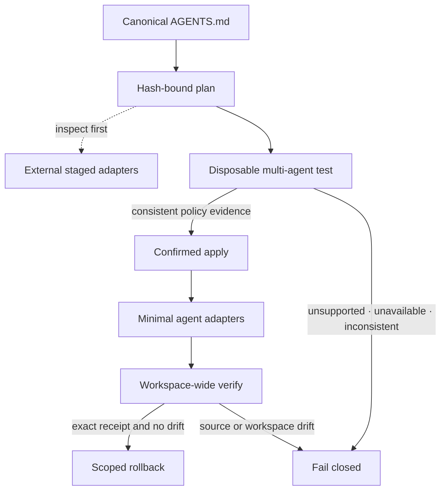

# Project harnesses

AFD can turn a repository with several agent-specific instruction files into a reviewable project
harness. The design uses one canonical project policy, minimal agent adapters, disposable testing,
and a confirmed apply. AFD does not silently merge instructions or assume that a filename proves an
agent will discover it.

## The four gates

1. `afd harness audit <project>` is read-only. It identifies the canonical policy, agent surfaces,
   duplicate or conflicting instructions, unsupported discovery claims, instruction-size risks, and
   strict legacy-pointer candidates.
2. `afd harness plan <project> --agents <list> [--remove-legacy]` produces a human-readable or JSON
   plan bound to the canonical SHA-256, Git revision, and Git-visible workspace fingerprint. Use
   `afd harness stage ... --output <outside-directory>` to inspect rendered adapters without writing
   to the project. Staging remains available for a blocked plan.
3. `afd harness test ...` checks runner readiness without invoking agents. Add `--live --evidence
   <outside-project-file>` to render the proposal into a disposable policy-only workspace and start
   fresh read-only sessions. Every selected agent must independently return the same canonical-policy
   fingerprint. Unsupported or unavailable agents fail closed; they are never silently skipped.
4. `afd harness apply ... --evidence <passing-report> --confirm <plan-token>` recomputes the plan and
   requires the exact reviewed token and its matching live evidence. It writes only reviewed adapter
   and legacy-cleanup actions, transactionally. `verify` checks the canonical source, every applied
   artifact, the Git revision, and the Git-visible workspace fingerprint. `rollback` refuses drift,
   restores exact prior bytes, and requires the same token.

## Canonical policy and adapters

`AGENTS.md` is the canonical project policy when present. Agent-specific files contain only an
AFD-marked pointer to that source. The pointer records the canonical hash but does not copy project
rules. This keeps behavior consistent while avoiding duplicated instruction bodies.

AFD preserves any divergent project-owned adapter and blocks definitive apply. The plan names the
file that needs human reconciliation; AFD will not discard potentially meaningful instructions.
After the rules are moved into the canonical source and the adapter is removed or converted to the
reviewed pointer, rerun the audit and plan to obtain a new token.

`--remove-legacy` is intentionally narrow. AFD only proposes removal for a recognized redundant
pointer or an unselected thin pointer. A file such as `AGY.md` is not removed merely because its name
looks old: Agy and Antigravity are distinct targets, and unverified discovery remains visible as a
blocker.

## Receipts and rollback

Smoke evidence must be outside the target repository. Apply and rollback receipts are stored under
AFD's per-user state directory, not committed into the project. They contain the exact before and
after bytes needed for scoped rollback and are protected with user-only permissions. A receipt is
valid only for its project, plan token, selected agents, and workspace state.

The read-only audit and plan are intentionally repeatable. Any source, Git revision, workspace,
staged-output, evidence, or applied-state drift stops the workflow and requires a fresh audit or
plan. This is how a review can proceed incrementally without an older approval being applied to a
newer project state.

## Execution readiness and current native contracts

Codex, Agy CLI, and Grok Build consume `AGENTS.md` natively; Claude Code uses a thin
`CLAUDE.md` pointer. Pi supports the canonical policy and its recognized adapter surface.
Native discovery support is a capability contract, not proof that a particular installed
version passed the live test. Agy CLI uses `--add-dir <disposable-workspace> --mode plan --sandbox`;
explicit workspace registration permits its scoped file reads in headless sessions. Disabling slash
expansion disables its plan mode and is therefore not a safe combination. Grok's
bounded test permits multiple turns so reading the file can precede the final response.
The legacy `antigravity` target remains separate and unverified.

Readiness requires a successful nonempty version probe, not merely a PATH lookup.
Reports distinguish lookup failure, denied access, version failure and timeout, and
identify the execution context. Windows native executables and PowerShell shims use
structured arguments under the process-tree runner; unsafe batch-only fallback is rejected.

Plans hash Git-visible file contents as well as status and revision. An unborn repository
has a null revision but a real content fingerprint. Invalid Git metadata and access failures
stop planning. A plain non-Git folder receives a content fingerprint of its file tree.

Live tests use a disposable workspace below the process temporary directory. In a
no-op plan, already-installed instruction entrypoints are copied too: an empty change
list must not remove the harness's discovery surface from the test. Proposed removals
are excluded from that disposable workspace. The prompt tests discovery rather than
starting the project's development workflow.

In a
restricted executor, select an approved writable temporary root in the process environment
before launching the tests; do not relax the executor's security controls. Model permission
modes and workspace snapshots do not establish a complete host sandbox. Tests require
authorization to send the canonical policy to each selected model service.

Discovery references: [Grok instructions](https://docs.x.ai/build/features/skills-plugins-marketplaces),
[Agy project context](https://www.agy.dev/docs/cli/best-practices/), and
[Agy modes](https://www.agy.dev/docs/cli/modes/).
