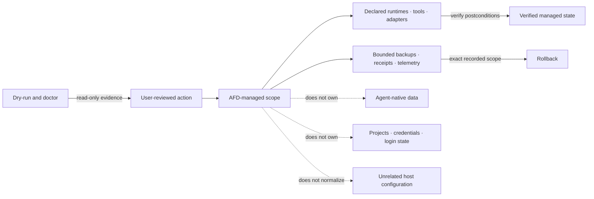

# Security boundaries

- Use official sources, verifiable versions, dry-run, and separate verification.
- Keep project dependencies isolated and never manage user secrets or login state.
- Preserve drift and require human review before promoting pending or Hermes-created skills.
- Back up existing managed files under `%LOCALAPPDATA%\AI Foundry Desk\backups` before replacement.
- Keep `afd doctor` and `afd fix layer1 --dry-run` strictly read-only, including logs and state.
- Keep `afd fix sandbox --dry-run` read-only. `afd doctor` may inspect the fixed sandbox-access
  target set but must never repair it implicitly.
- Limit `afd fix layer1 --apply` to declared AFD packages, runtimes, environment, PATH, shims,
  PNPM_HOME, the pinned allow-scripts CLI, Docker host capability, and marked profile blocks; never
  normalize unrelated machine state.
- Install `@lavamoat/allow-scripts` with lifecycle hooks disabled and verify its exact registry
  integrity. Installing the CLI does not approve scripts: pnpm `allowBuilds` or a reviewed
  project-local LavaMoat policy remains the repository's decision. Never silently weaken that policy.
- Leave third-party installation and updates with their normal package managers. Sandbox repair may
  grant only reviewed `ReadAndExecute` entries, after an explicit apply, with snapshot and rollback;
  it must not replace tools or broaden access to the entire portable-package root.
- Treat Docker as a Layer 1 host capability only. Never use it to execute Layers 1–3; higher layers
  may use it only after explicit user request or a documented technical necessity.
- The Windows WinGet Docker Desktop package may elevate. Never start Desktop, accept its in-app
  terms, change its backend, or add a user to `docker-users` or the root-equivalent Linux `docker`
  group automatically.
- The macOS Docker adapter must verify Docker's published architecture-specific checksum and app
  signature before requesting administrator authorization. It must not pass `--accept-license`,
  `--user`, proxy, organization, or admin-settings flags, and must not launch Docker Desktop.
- Never use agent directories as the canonical catalog; Hermes receives a one-way copy.

AI Foundry Desk is not a sandbox and cannot audit every upstream dependency. Stop and review scripts
that request elevation, alter profiles, create services, or write outside expected targets. Use a
disposable environment for untrusted code.
