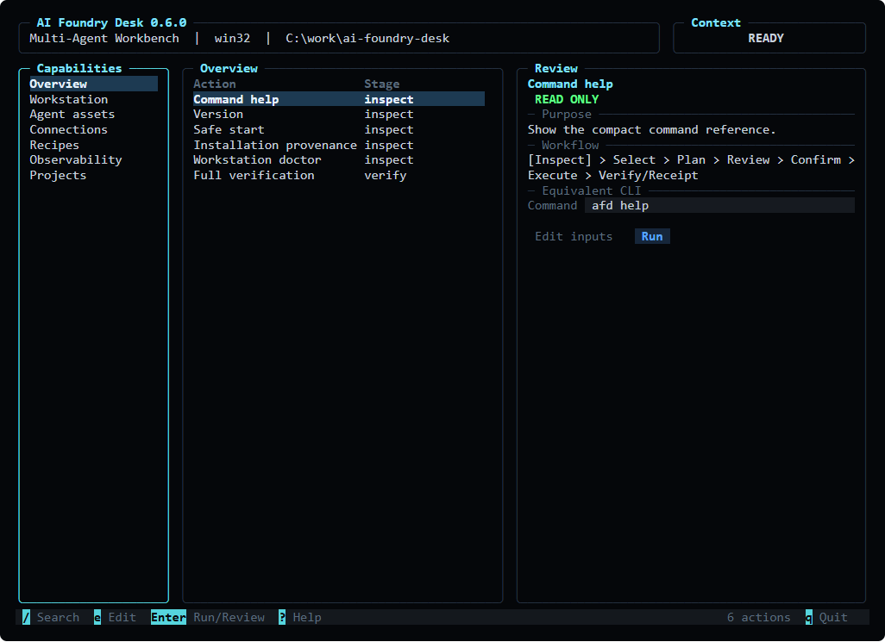
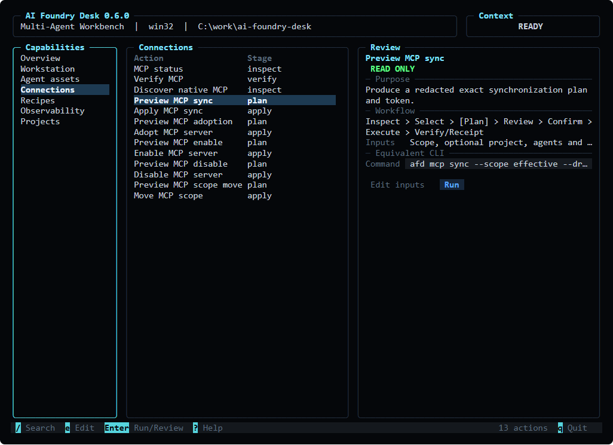
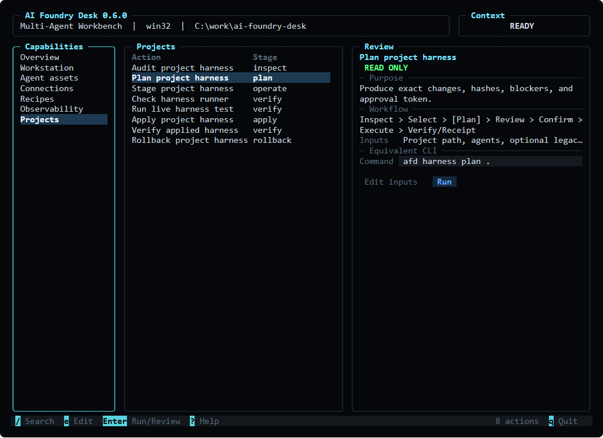
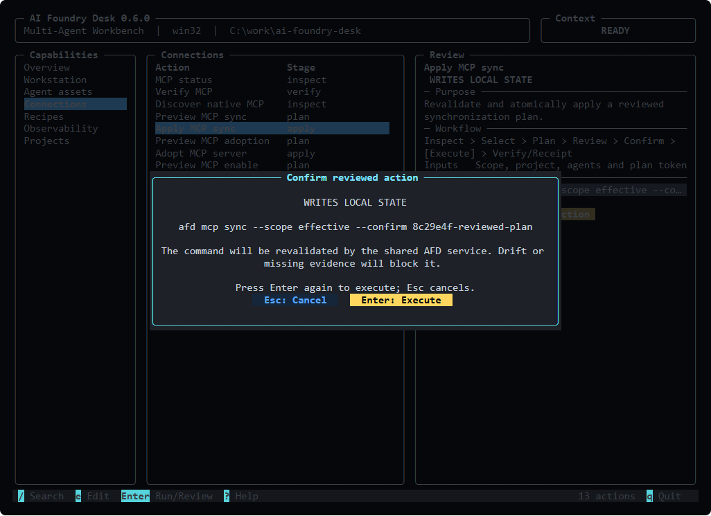
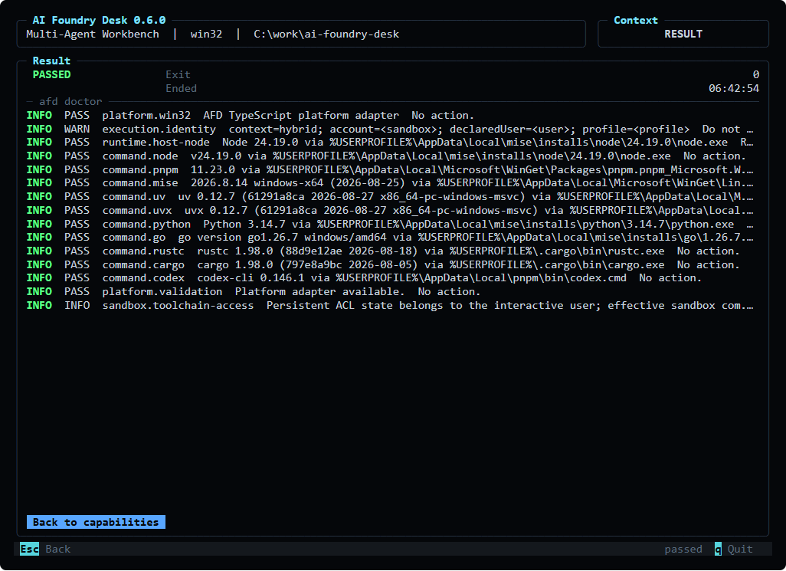

# Terminal user interface

`afd tui` is the interactive, keyboard-first view of the AI Foundry Desk control plane. It covers
the complete public CLI taxonomy without replacing the line-oriented CLI. Automation, redirected
output, and screen-reader workflows should continue to use the documented commands directly.

The TUI is built with exact-pinned `@profullstack/hqtui` and runs on the same Node.js 24 runtime as
AFD. It does not spawn `afd`, parse its stdout, or duplicate validation and mutation rules. Both
interfaces call the same application service and existing domain/platform modules.

## Start

```powershell
afd tui
```

The command requires an interactive TTY. Bare `afd`, every existing subcommand, exit codes, and
machine-readable output remain unchanged.

Optional presentation settings:

| Setting | Effect |
| --- | --- |
| `NO_COLOR=1` | Monochrome rendering |
| `AFD_TUI_THEME=highContrast` | Use an HQTUI built-in theme such as `highContrast`, `light`, `nord`, or `gruvbox` |
| `AFD_TUI_REDUCED_MOTION=1` | Disable animation-driven redraws |
| `AFD_TUI_ASCII=1` | Disable Unicode and Braille rendering |
| `AFD_TUI_MOUSE=0` | Disable mouse tracking; all actions remain keyboard-accessible |
| `AFD_TUI_INLINE=1` | Render without the alternate screen for constrained PTYs or terminal recording |

## The interface

The wide layout uses capability navigation, an action table, and a contextual review pane. At
smaller widths it collapses to tabs and then a single stacked flow while preserving selection.



The taxonomy is based on user intent rather than raw parser nesting:

| Area | CLI coverage |
| --- | --- |
| Overview | help, version, init, provenance, doctor, and full verification |
| Workstation | Layers 1–2, repairs, backups, and migration |
| Agent assets | catalog, status/review, synchronization, adopt/import, pending review, promote/reject/recover, and Hermes update |
| Connections | MCP status, verify, discovery, synchronization, adoption, enable/disable, and scope movement |
| Recipes | list, show, plan, apply, verify, rollback, and extraction |
| Observability | plan/apply, health, verification, run explanation, refresh, trace, stop/resume, and autostart removal |
| Projects | harness audit, plan, external stage, readiness/live test, evidence-bound apply, receipt verification, and rollback |

The internal `telemetry broker` entry point is represented only by runtime status; it is not offered
as an interactive user action. The typed capability registry contains 74 inspect, plan, apply,
verify, operate, and rollback actions. Aliases such as `import` are presented once.

### Review a scoped integration

Every action shows purpose, required inputs, workflow stage, write scope, and the exact equivalent
CLI. Press `e` to edit placeholder values. The field is parsed directly into an argument array;
it is never evaluated by a shell.



### Follow evidence-gated workflows

Project harnesses retain their audit → plan → stage/test → apply → verify/rollback contract. The UI
does not make generated files, stale evidence, or a copied token look valid.



### Confirm a mutation

Read-only actions run with `Enter`. Any action that can write requires a separate review modal and
`Enter` again inside the modal. The full command is revalidated below the UI. Drift, unsupported targets, missing
tokens, identity mismatch, and stale evidence continue to fail closed.



### Inspect structured outcomes

Exit code `0` is `PASSED`, exit code `2` is `ACTION-NEEDED`, and exit code `1` is `ERROR`. The TUI
renders typed stdout/stderr events in a bounded log viewer without interpreting domain output.



The doctor screenshot is generated from a real read-only execution. The capture script redacts
machine-specific identity and paths before producing public documentation.

## Keyboard map

| Key | Action |
| --- | --- |
| `Left` / `Right` | Move between capability areas |
| `Up` / `Down` | Select an action |
| `/` | Search title, intent, category, or exact CLI in the command palette |
| `e` | Edit inputs in the equivalent command field |
| `Enter` | Run a read-only action or open write review |
| `Enter` in confirmation modal | Execute an explicitly reviewed write |
| `Esc` | Close an overlay, cancel editing, or return from output |
| `r` | Run or review the selected action |
| `?` | Open keyboard and accessibility help |
| `q` or `Ctrl+C` | Quit when no operation is running |

Paste is bracketed and normalized. Mouse selection and scrolling are optional enhancements; no
capability depends on them.

## Safety and architecture

The implementation has four boundaries:

```text
domain and platform modules
  validation · planning · drift · tokens · transactions · receipts · rollback
                         │
                         ▼
typed application service
  argv request · stdout/stderr events · exit code · domain outcome
                 ┌───────┴────────┐
                 ▼                ▼
             CLI adapter       TUI adapter
          stdout / exit       state / focus / render
                                  │
                                  ▼
                                HQTUI
```

- `command-service.ts` contains the existing command orchestration and is the only caller of the
  domain/platform operations.
- `application-service.ts` exposes a typed in-process execution result. It does not invoke a shell.
- `cli.ts` renders the normal line-oriented interface or dynamically loads `afd tui`.
- `tui/` owns only navigation, form state, focus, confirmation presentation, and output rendering.
- `capability-registry.ts` is the machine-checkable coverage and safety taxonomy.

Command execution is serialized within one TUI session because the underlying platform operations
are intentionally single-user workflows. A running mutation cannot be detached from the UI; wait
for its result or interrupt the AFD process, which lets HQTUI restore the terminal.

## Accessibility and terminal support

- Every action is keyboard-accessible and focus is visible.
- Status combines text with color; meaning never depends on red/green alone.
- Monochrome, high-contrast, no-color, reduced-motion, mouse-off, and ASCII modes are supported.
- Wide characters and limited color modes are handled by HQTUI's terminal capability layer.
- The existing CLI remains the non-alternate-screen and screen-reader path.
- When stdout or stdin is not a TTY, `afd tui` refuses cleanly and points to the CLI.

Validated render sizes are 120×40, 100×30, 80×24, and 70×22. Tests also cover high contrast,
monochrome, colorless ASCII, modal confirmation, and action-needed output.

## Reproduce the screenshots

Build first, then provide a local Playwright package directory. The script uses a local Chromium or
Edge executable, executes only the read-only doctor action, renders the production view through
HQTUI, redacts machine-specific provenance, and writes PNGs under `docs/images/tui`.

```powershell
pnpm build
$env:AFD_PLAYWRIGHT_ROOT = "C:\path\to\node_modules\playwright"
node scripts/capture-tui-screens.mjs
```

No browser dependency is added to the release package.
